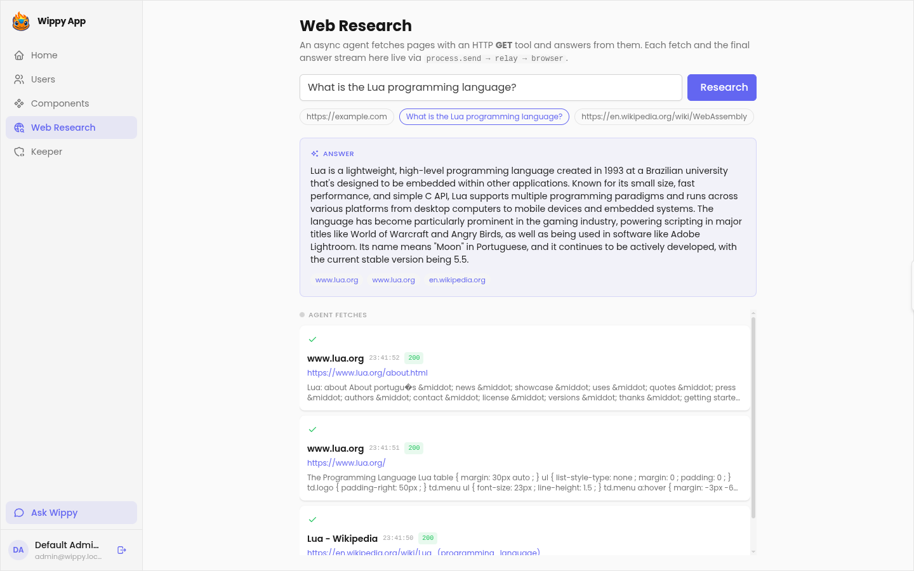
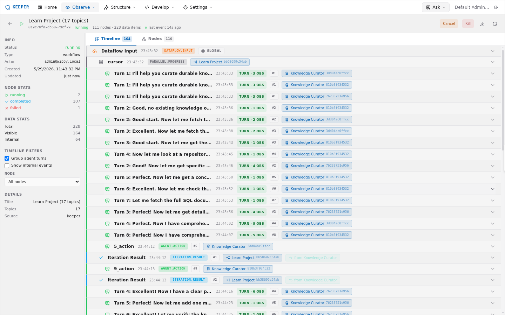

# Wippy Application Template

A starter Wippy application: a Vue admin frontend, user management, an AI assistant, example web components, a live **Web Research** demo, and the **Keeper** console for editing the running app from the browser.



## Prerequisites

- [Wippy CLI](https://wippy.ai) — the `wippy` binary on your `PATH`
- Node.js 18+

## Quick start

```bash
wippy install         # download backend modules from the hub into .wippy/
cp .env.example .env  # configure environment (add ANTHROPIC_API_KEY for the AI features)
make build            # build the frontend bundles
wippy run -c          # start the runtime
```

- **App** — <http://localhost:8080> · default admin `admin@wippy.local` / `admin123`
- **Keeper** — <http://localhost:8080/app/keeper>

## What's inside

- **Users** — CRUD over accounts and security groups
- **AI assistant** — chat with an agent ("Ask Wippy") from any page
- **Components** — six example web components (charts, mermaid, markdown, and more)
- **Web Research** — an async dataflow where a researcher agent fetches pages with an HTTP GET tool and streams each fetch and the final answer to the browser live (`src/app/research/`)
- **Keeper** — a development console to edit the registry, sync `src/**`, build components, and inspect dataflows, sessions, and logs against the running app

## Editing the app live

Keeper makes the running app self-modifying — the app and the tool that edits it are the same process, so you change the registry from the browser without restarting. It also observes every dataflow (the Web Research demo shows up here), and exposes the same operations over MCP at `/keeper-mcp/` for AI agents. Because it can rewrite the registry, treat Keeper access as admin-level in production.



## Project structure

```
src/app/                 Backend (Wippy Lua) — endpoints, agents, users, models, views, deps
  research/              Web Research demo: agent + HTTP GET tool + dataflow
frontend/
  applications/main/     Vue 3 admin app (the page you see)
  web-components/        Example standalone web components
  docs/                  Frontend & theming guides (start here for FE work)
static/                  Static assets + generated bundles (static/app, static/wc)
```

## Development

```bash
cd frontend/applications/main && npm run dev   # frontend watch mode
make build                                     # rebuild all bundles to static/
wippy run -c                                   # server
```

## Frontend & theming

All frontend, theming, and web-component guidance lives in [`frontend/docs/`](frontend/docs/README.md). The one rule worth stating up front: customize appearance through the **facade** (`src/app/deps/_index.yaml`) — `css_variables` / `custom_css` propagate to every page and component; per-app CSS does not. See [`frontend/docs/theming.md`](frontend/docs/theming.md).

## Testing

```bash
wippy run test users
```

## Documentation

- [wippy.ai](https://wippy.ai) — full documentation · [llms.txt](https://wippy.ai/llms.txt)
- [`frontend/docs/README.md`](frontend/docs/README.md) — component, app, proxy-API, host, and theming guides
